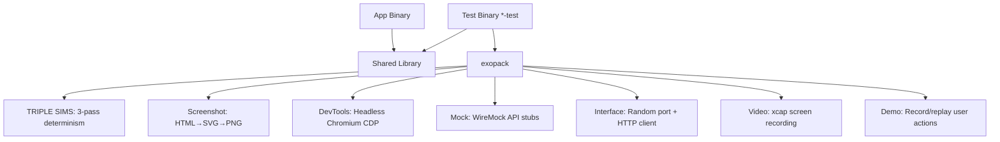

<!-- Unlicense — cochranblock.org -->

# Proof of Artifacts

*Concrete evidence that this project works, ships, and is real.*

> The quality gate behind every CochranBlock binary. No external test frameworks — the test binary IS the CI.

## Architecture



## Build Output

| Metric | Value |
|--------|-------|
| Modules | 8 (triple_sims, screenshot, devtools, mock, interface, video, demo, baked_demo) |
| Feature gates | 8 — each module optional, zero mandatory bloat |
| Projects using exopack | 5+ (cochranblock, kova, oakilydokily, whyyoulying, wowasticker) |
| Architecture doc | 2,286 lines — testing philosophy, patterns, anti-patterns |
| TRIPLE SIMS passes | 3 sequential runs, all must pass (eliminates flaky tests) |
| Screenshot method | Pure Rust HTML→SVG→PNG (no Chrome dependency for basic capture) |

## Key Artifacts

| Artifact | Description |
|----------|-------------|
| TRIPLE SIMS | Run test suite 3x sequentially — all must pass. Detects race conditions, non-determinism, flaky tests |
| Two-Binary Model | Production binary has zero test deps. Test binary is self-contained quality gate |
| Screenshot Capture | Pure Rust rendering for CI. Optional Chromium DevTools for full-page visual verification |
| Mock Server | WireMock integration on random ports — isolated integration tests without real APIs |
| Demo Record/Replay | Capture WebClick, WebInput, ApiCall, EguiSend actions as JSON for automated replay |
| Baked Demo | Zero-user-input automation: CLI subcommands + all HTTP endpoints exercised |
| HTTP Harness | Bind to :0 (random port) + cookie-store client — test servers without port conflicts |

## How to Verify

```bash
# Any project using exopack:
cargo run -p cochranblock --bin cochranblock-test --features tests
# Runs: clippy → TRIPLE SIMS (3 passes) → exit 0 or 1

# exopack standalone:
cargo run -p exopack -- live-demo <project_dir>
```

---

*Part of the [CochranBlock](https://cochranblock.org) zero-cloud architecture. All source under the Unlicense.*
