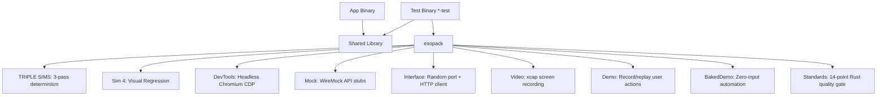
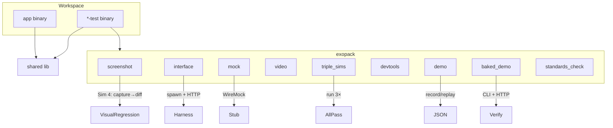

<!-- Unlicense — cochranblock.org -->

# Proof of Artifacts

*Concrete evidence that this project works, ships, and is real.*

> The quality gate behind every CochranBlock binary. No external test frameworks — the test binary IS the CI.

## Architecture



## Wire / Workspace View



## Build Output

| Metric | Value |
|--------|-------|
| Source LOC | 6,149 across src/ + tests/ (2026-05-18 measurement) |
| Modules | 10 core (triple_sims, screenshot, devtools, mock, interface, video, demo, baked_demo, standards_check, ats_fixtures) + harvest + guard |
| Public functions | 67 library + CLI (f60–f139, f170; pub fn count via grep) |
| Public types | 14 pub struct/enum/trait + tokenized t60–t67, t70–t80 |
| Feature gates | 13 (ats_fixtures + harvest added since v0.3 split) |
| Direct deps (all features) | 17 from crates.io |
| Direct deps (standards_check) | 0 — pure std + cargo CLI |
| MSRV | 1.85 (matches edition 2024 floor, 33ceb9e) |
| Unit tests | 65 (with all features; `cargo test --features "screenshot,mock,interface,triple_sims,devtools,baked_demo,harvest,standards_check,ats_fixtures"`) |
| Integration tests | 20 cases across 5 files — ats_fixtures (8), harvest (7), baked_demo (3, 1 ignored), portfolio_standards (1), video_cfg (1) |
| Binary size (release, Linux x86_64, `--features cli`) | 8,022,280 bytes (7.6 MB) — includes chromiumoxide (headless browser); strip=true |
| Release profile | opt-level='z', lto=true, codegen-units=1, panic='abort', strip=true |
| Projects using exopack | 6+ (cochranblock, kova, oakilydokily, whyyoulying, wowasticker, nanobyte) |
| Architecture doc | 2,286 lines — testing philosophy, patterns, anti-patterns |
| Compression map | P13 complete — 72 functions, 19 types, 46 fields, 1 CLI command |
| Federal compliance docs | 12 documents in govdocs/ (SBOM, SSDF, FIPS, CMMC, supply chain audit) |
| Known vulnerabilities | 1 (idna 0.3.0 — non-exploitable on localhost, documented) |
| GitHub Release | v0.1.0 — macOS ARM + Linux x86_64 binaries |

## Modules / Features

- **screenshot** — Sim 4 visual regression: capture → baseline → pixel diff → red-highlight diff image. Auto-creates baselines on first run. Pure Rust (no Chrome for basic capture, devtools fallback for full browser)
- **interface** — Test server harness: random-port binding, HTTP client with cookie store
- **triple_sims** — Run test runner 3 times; all must pass. Includes live-demo and test-bin discovery
- **devtools** — Headless Chromium via CDP: console error check, full-page screenshots (WASM-aware)
- **mock** — WireMock for on-demand API mocking (GET/POST text/JSON, custom status codes)
- **video** — Screen capture trait + xcap impl (always compiled; xcap requires `video` feature)
- **demo** — Action script recording: WebClick, WebInput, ApiCall, EguiSend → JSON replay
- **baked_demo** — Zero-input automation: exercises all CLI subcommands + HTTP endpoints
- **standards_check** — 14-point Rust industry standards gate: clippy, fmt, audit, deny, MSRV, unsafe, docs, changelog, license, P16 test binary, allow(unused), error handling, secrets, Cargo.toml metadata. Runs against entire portfolio (10 projects, 140 checks)
- **ats_fixtures** — Self-contained HTML mocks for 5 ATS vendors (Greenhouse, Lever, Workday, iCIMS, Ashby). Pure Rust, zero deps. Adversarial knobs: `late_hydration_ms`, `dynamic_ids`, `rebuild_on_focus`. Used for end-to-end browser-autofill tests in atsisbroken — drop a fixture into chromiumoxide via `Page::set_content` and exercise CDP without touching the network

## Standards Gate (P23 Triple Lens validated)

```
cargo test --features standards_check portfolio_standards_gate -- --nocapture
```

14 checks per project. Pass/fail table across the portfolio. First baseline: 72/140.

| Check | What it verifies |
|-------|-----------------|
| clippy | `cargo clippy -- -D warnings` zero warnings |
| fmt | `cargo fmt --check` properly formatted |
| audit | `cargo audit` no known vulnerabilities |
| deny | `cargo deny check` license compliance |
| msrv | `rust-version` declared in Cargo.toml |
| unsafe | `#![forbid(unsafe_code)]` or justified usage |
| docs | `//!` module docs in lib.rs or main.rs |
| changelog | CHANGELOG.md or TIMELINE_OF_INVENTION.md exists |
| license_file | LICENSE/UNLICENSE file present |
| test_binary | P16 `*-test` binary in Cargo.toml |
| allow_unused | No unjustified `#[allow(unused)]` |
| error_handling | No `unwrap()` in library code |
| secrets | No .env files or hardcoded keys committed |
| cargo_meta | description, license, repository in Cargo.toml |

## Quick Start

### 1. Add the dep

```toml
# Cargo.toml in your application crate
[dependencies]
exopack = { version = "0.3", features = ["triple_sims", "interface"] }

# Add a test binary that imports your library and runs through TRIPLE SIMS:
[[bin]]
name = "myapp-test"
path = "src/bin/myapp-test.rs"
required-features = ["tests"]

[features]
tests = []  # gate any test-only deps/code on this feature
```

### 2. Write the minimal `*-test` binary (≈10 lines)

```rust
// src/bin/myapp-test.rs

// Compile-time guard: refuse to build the test binary in release profile —
// a release+tests build would ship test internals as a production artifact.
exopack::deny_release_with_tests!();

#[tokio::main]
async fn main() {
    let ok = exopack::triple_sims::run(|| async {
        // Your actual smoke test: spin up the server, hit a route, assert.
        myapp::tests::run_smoke().await
    }).await;
    std::process::exit(if ok { 0 } else { 1 });
}
```

### 3. CI: GitHub Actions

```yaml
# .github/workflows/test.yml
name: test
on: [push, pull_request]

jobs:
  triple-sims:
    runs-on: ubuntu-latest
    steps:
      - uses: actions/checkout@v4
      - uses: dtolnay/rust-toolchain@stable
      - uses: Swatinem/rust-cache@v2
      - name: TRIPLE SIMS gate
        run: cargo run --bin myapp-test --features tests
```

### 4. (Optional) Visual regression in CI

```rust
// inside the test runner closure
let report = exopack::screenshot::visual_regression(
    "http://localhost:8080", "myapp",
    &[("home", "/"), ("about", "/about")], 10, 1.0,
).await;
report.print_summary();
report.all_passed
```

First run **stages** baselines into `~/.cache/screenshots/{os}/myapp/baselines_pending/` —
nothing is trusted until a human runs `exopack baselines accept myapp` (or calls
`screenshot::accept_pending_baselines`). This is deliberate; auto-promoting on first
run lets an attacker poison your baselines.

## CLI Commands

```bash
# Build the binary with the full subcommand set
cargo install exopack --features cli

exopack live-demo ./myapp --features tests   # build+run *-test with live output
exopack standards . --json                   # 14-point standards gate (JSON or table)
exopack baselines accept myapp               # promote pending baselines to trusted
exopack screenshot https://example.com out.png   # one-shot capture (devtools)
exopack compare a.png b.png                  # pixel diff, exit 0 == match
exopack ats-fixture workday --dynamic-ids --late-hydration 500 > workday.html
exopack ats-fixture lever --out lever.html   # 5 vendors: greenhouse|lever|workday|icims|ashby
exopack govdocs sbom                         # baked federal compliance docs
exopack --sbom > exopack.spdx                # machine SPDX
```

## QA Results (2026-05-13)

- New integration tests landed for `ats_fixtures` (8 cases) and `harvest` (7 cases) — the two largest modules previously without consumer-facing test coverage. `tests/ats_fixtures.rs` pins the cross-vendor schema contract (canonical classifier vocab, expected-id ↔ rendered-HTML reachability, FixtureOpts orthogonal effects, Lever/Ashby `full_name` collapse). `tests/harvest.rs` pins the testable surface without a live Chrome (HarvestConfig defaults, build_prompt determinism, default_chrome_bin with `EXOPACK_CHROME_BIN` override, find_gemini_ws Err on no CDP listener, harvest_one Err on unreachable ws_url).
- `cargo test --features "screenshot,triple_sims,standards_check,ats_fixtures,harvest"`: 83/83 pass across 9 test binaries on bt node (12-core x86_64 Debian). Library unit tests 65, integration tests 17 (some baked_demo + video_cfg cases gated). Wallclock 153s — dominated by `portfolio_standards_gate` running 14 standards checks × 10 projects.
- `video` feature unavailable on bt node (libpipewire-0.3 system dep absent); xcap unit tests skipped. video_cfg.rs `without_video` test still verifies the cfg-gate works correctly.
- Module count corrected: 10 core (was 9 pre-`ats_fixtures` from commit `5c329cc`). `harvest` and `guard` are auxiliary modules — harvest is a CDP automation concern, guard is a compile-time tripwire macro.

## QA Results (2026-04-09)

- MSRV raised to `1.85` to match the already-declared edition 2024 floor (commit `33ceb9e`). Previously the MSRV field lagged the edition field — a 1.84 build would have failed with a confusing error instead of a direct MSRV rejection.
- Human Revelations section added to Timeline of Invention (commit `ef0eb32`): Triple Sims, Two-Binary Model, Sim 4 Visual Regression — each with origin story, problem/insight/technique/result.
- Unit test count: 49 across exopack core (screenshot 8, triple_sims 9, demo 3, video 3, standards_check 26). Kova-internal pattern harnesses (checkpoint, compaction, dual_mode, perm_gate — 38 tests) split out for v0.3 to refocus this crate on testing-augmentation primitives.
- Video module now feature-gated (dcf18d1) — no longer always-compiled. `cargo build -p exopack` with default features no longer pulls xcap.
- Feature gate count: 9 (was 13 — checkpoint/compaction/dual_mode/perm_gate removed in v0.3).

## QA Results (2026-03-27)

### QA Round 1
- `cargo build --release`: Clean, zero warnings
- `cargo build --release --all-features`: Clean, zero warnings
- `cargo test --features "screenshot,triple_sims,demo"`: 17/17 pass
- `cargo clippy -- -D warnings`: Pass (default + all-features)
- AI slop scan (P12): Zero banned words
- Debug artifact scan: Zero `dbg!`, `TODO`, `FIXME`

### QA Round 2
- `cargo clean && cargo build --release`: Clean from scratch
- `cargo clippy --release -- -D warnings`: Pass
- `cargo clippy --release --all-features -- -D warnings`: Pass
- Cross-process test race: Found and fixed (PID-scoped temp dirs)
- Git status: Clean (only Cargo.lock untracked → now committed)

### P13 Tokenization
- 28 functions renamed to compressed tokens (f60–f95)
- 8 types renamed (t60–t67)
- 19 fields documented (s60–s78)
- 1 CLI command mapped (c60)
- All cross-file references updated and verified

## Key Artifacts

| Artifact | Description |
|----------|-------------|
| TRIPLE SIMS | Run test suite 3x sequentially — all must pass. Detects race conditions, non-determinism, flaky tests |
| Two-Binary Model | Production binary has zero test deps. Test binary is self-contained quality gate |
| Sim 4 Visual Regression | Full orchestrator: capture → auto-baseline → pixel diff (configurable tolerance/threshold) → red-highlight diff PNG → per-page pass/fail report. `f76` to accept new state |
| Mock Server | WireMock: GET/POST text/JSON on random ports + custom status codes |
| Demo Record/Replay | Capture WebClick, WebInput, ApiCall, EguiSend actions as JSON for automated replay |
| Baked Demo | Zero-user-input automation: CLI subcommands + all HTTP endpoints exercised |
| HTTP Harness | Bind to :0 (random port) + cookie-store client — test servers without port conflicts |
| User Story Analysis | 10-point user walkthrough, scored 5.4/10, top 3 fixes implemented |
| Standards Check Gate | 14-point Rust industry quality gate × 10 projects = 140 checks. Single test: `cargo test --features standards_check portfolio_standards_gate` |

## How to Verify

```bash
# Build release binary:
cargo build -p exopack --release --features triple_sims
./target/release/exopack --help
./target/release/exopack --version

# Run unit tests:
cargo test -p exopack --features "screenshot,triple_sims,demo"

# Clippy (warnings as errors):
cargo clippy -p exopack --release --all-features -- -D warnings

# Any project using exopack:
cargo run -p cochranblock --bin cochranblock-test --features tests
# Runs: clippy → TRIPLE SIMS (3 passes) → exit 0 or 1

# exopack standalone:
cargo run -p exopack --features triple_sims -- live-demo <project_dir>
```

---

*Part of the [CochranBlock](https://cochranblock.org) zero-cloud architecture. All source under the Unlicense.*
<!-- COCHRANBLOCK-BRAND-FOOTER:START - generated by cochranblock/scripts/brand-stamp.sh -->

---

<sub>&#9656; **THE COCHRAN BLOCK, LLC** &#183; CAGE `1CQ66` &#183; UEI `W7X3HAQL9CF9` &#183; UNLICENSE &#183; [cochranblock.org](https://cochranblock.org)</sub>
<!-- COCHRANBLOCK-BRAND-FOOTER:END -->
