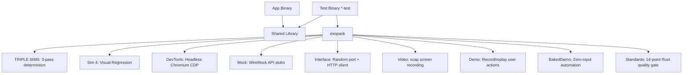

<!-- Unlicense — cochranblock.org -->

# Proof of Artifacts

*Concrete evidence that this project works, ships, and is real.*

> The quality gate behind every CochranBlock binary. No external test frameworks — the test binary IS the CI.

## Architecture



## Build Output

| Metric | Value |
|--------|-------|
| Source LOC | 3,960 across 15 source files (4,142 with tests) |
| Modules | 9 core (triple_sims, screenshot, devtools, mock, interface, video, demo, baked_demo, standards_check) + harvest (separate concern) |
| Public functions | 72 library + CLI (f60–f139, f170) |
| Public types | 19 (t60–t67, t70–t80) |
| Feature gates | 13 feature-gated (video now gated behind `feature = "video"`, dcf18d1) |
| Direct deps (all features) | 17 from crates.io |
| Direct deps (standards_check) | 0 — pure std + cargo CLI |
| MSRV | 1.85 (matches edition 2024 floor, 33ceb9e) |
| Unit tests | 49 across screenshot (8), triple_sims (9), demo (3), video (3), standards_check (26) |
| Integration tests | 7 cases across 3 files (baked_demo, portfolio_standards_gate, video_cfg) |
| Binary size (release, ARM, with govdocs) | 370,592 bytes (362 KB) |
| Binary size (release, Linux x86_64) | 393,288 bytes (384 KB) |
| Release profile | opt-level='z', lto=true, codegen-units=1, panic='abort', strip=true |
| Projects using exopack | 5+ (cochranblock, kova, oakilydokily, whyyoulying, wowasticker) |
| Architecture doc | 2,286 lines — testing philosophy, patterns, anti-patterns |
| Compression map | P13 complete — 72 functions, 19 types, 46 fields, 1 CLI command |
| Federal compliance docs | 12 documents in govdocs/ (SBOM, SSDF, FIPS, CMMC, supply chain audit) |
| Known vulnerabilities | 1 (idna 0.3.0 — non-exploitable on localhost, documented) |
| GitHub Release | v0.1.0 — macOS ARM + Linux x86_64 binaries |

## QA Results (2026-04-09)

- MSRV raised to `1.85` to match the already-declared edition 2024 floor (commit `33ceb9e`). Previously the MSRV field lagged the edition field — a 1.84 build would have failed with a confusing error instead of a direct MSRV rejection.
- Human Revelations section added to Timeline of Invention (commit `ef0eb32`): Triple Sims, Two-Binary Model, Sim 4 Visual Regression — each with origin story, problem/insight/technique/result.
- Unit test count: 49 across exopack core (screenshot 8, triple_sims 9, demo 3, video 3, standards_check 26). Kova-internal pattern harnesses (checkpoint, compaction, dual_mode, perm_gate — 38 tests) split out for v0.3 to refocus this crate on testing-augmentation primitives.
- Video module now feature-gated (dcf18d1) — no longer always-compiled. `cargo build -p exopack` with default features no longer pulls xcap.
- Feature gate count: 9 (was 13 — checkpoint/compaction/dual_mode/perm_gate removed in v0.3).

## QA Results (2026-03-27)

### QA Round 1
- `cargo build --release`: Clean, zero warnings
- `cargo build --release --all-features`: Clean, zero warnings
- `cargo test --features "screenshot,triple_sims,demo"`: 17/17 pass
- `cargo clippy -- -D warnings`: Pass (default + all-features)
- AI slop scan (P12): Zero banned words
- Debug artifact scan: Zero `dbg!`, `TODO`, `FIXME`

### QA Round 2
- `cargo clean && cargo build --release`: Clean from scratch
- `cargo clippy --release -- -D warnings`: Pass
- `cargo clippy --release --all-features -- -D warnings`: Pass
- Cross-process test race: Found and fixed (PID-scoped temp dirs)
- Git status: Clean (only Cargo.lock untracked → now committed)

### P13 Tokenization
- 28 functions renamed to compressed tokens (f60–f95)
- 8 types renamed (t60–t67)
- 19 fields documented (s60–s78)
- 1 CLI command mapped (c60)
- All cross-file references updated and verified

## Key Artifacts

| Artifact | Description |
|----------|-------------|
| TRIPLE SIMS | Run test suite 3x sequentially — all must pass. Detects race conditions, non-determinism, flaky tests |
| Two-Binary Model | Production binary has zero test deps. Test binary is self-contained quality gate |
| Sim 4 Visual Regression | Full orchestrator: capture → auto-baseline → pixel diff (configurable tolerance/threshold) → red-highlight diff PNG → per-page pass/fail report. `f76` to accept new state |
| Mock Server | WireMock: GET/POST text/JSON on random ports + custom status codes |
| Demo Record/Replay | Capture WebClick, WebInput, ApiCall, EguiSend actions as JSON for automated replay |
| Baked Demo | Zero-user-input automation: CLI subcommands + all HTTP endpoints exercised |
| HTTP Harness | Bind to :0 (random port) + cookie-store client — test servers without port conflicts |
| User Story Analysis | 10-point user walkthrough, scored 5.4/10, top 3 fixes implemented |
| Standards Check Gate | 14-point Rust industry quality gate × 10 projects = 140 checks. Single test: `cargo test --features standards_check portfolio_standards_gate` |

## How to Verify

```bash
# Build release binary:
cargo build -p exopack --release --features triple_sims
./target/release/exopack --help
./target/release/exopack --version

# Run unit tests:
cargo test -p exopack --features "screenshot,triple_sims,demo"

# Clippy (warnings as errors):
cargo clippy -p exopack --release --all-features -- -D warnings

# Any project using exopack:
cargo run -p cochranblock --bin cochranblock-test --features tests
# Runs: clippy → TRIPLE SIMS (3 passes) → exit 0 or 1

# exopack standalone:
cargo run -p exopack --features triple_sims -- live-demo <project_dir>
```

---

*Part of the [CochranBlock](https://cochranblock.org) zero-cloud architecture. All source under the Unlicense.*
