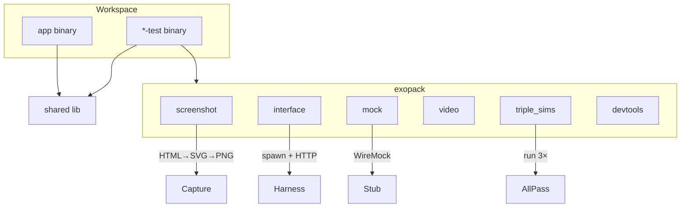

> **It's not the Mech — it's the pilot.**
>
> This repo is part of [CochranBlock](https://cochranblock.org) — 8 Unlicense Rust repositories that power an entire company on a **single <10MB binary**, a laptop, and a **$10/month** Cloudflare tunnel. No AWS. No Kubernetes. No six-figure DevOps team. Zero cloud.
>
> **[cochranblock.org](https://cochranblock.org)** is a live demo of this architecture. You're welcome to read every line of source code — it's all public domain.
>
> Every repo ships with **[Proof of Artifacts](PROOF_OF_ARTIFACTS.md)** (wire diagrams, screenshots, and build output proving the work is real) and a **[Timeline of Invention](TIMELINE_OF_INVENTION.md)** (dated commit-level record of what was built, when, and why — proving human-piloted AI development, not generated spaghetti).
>
> **Looking to cut your server bill by 90%?** → [Zero-Cloud Tech Intake Form](https://cochranblock.org/deploy)

---

# exopack

Testing augmentation for Rust binaries: screenshot capture, video recording, interface creation, API mocking, TRIPLE SIMS.

Used by cochranblock, kova, approuter, oakilydokily, whyyoulying, wowasticker for test binaries (`*-test`).

## Wire / Architecture

## Features

- **screenshot** — Pure Rust HTML→SVG→PNG capture (no Chrome)
- **interface** — Test server harness, HTTP client helpers
- **triple_sims** — Run test runner 3 times; all must pass
- **devtools** — Headless browser console check via CDP
- **mock** — WireMock for on-demand API mocking
- **video** — xcap screen capture + recording

## Docs

- [docs/testing_architecture.md](docs/testing_architecture.md) — Two-binary test model
- [docs/ROUGH_DRAFT_EXOPACK.md](docs/ROUGH_DRAFT_EXOPACK.md) — Design notes
